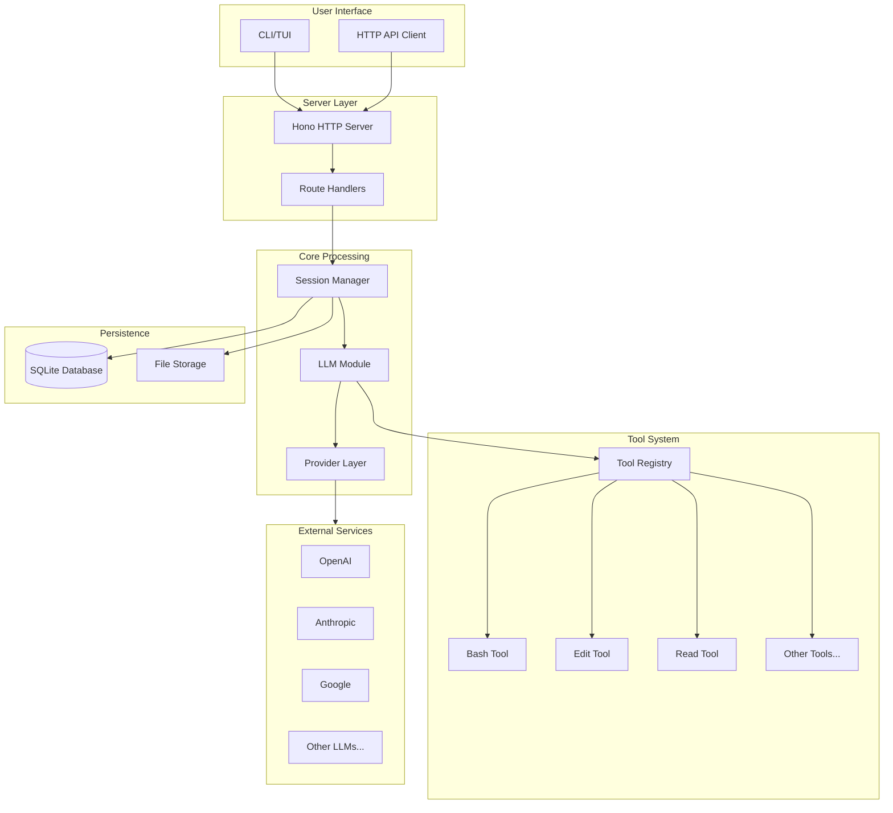
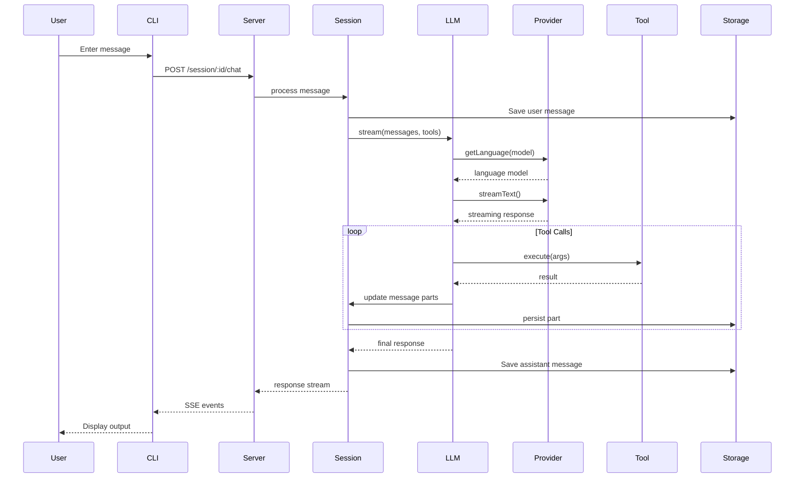
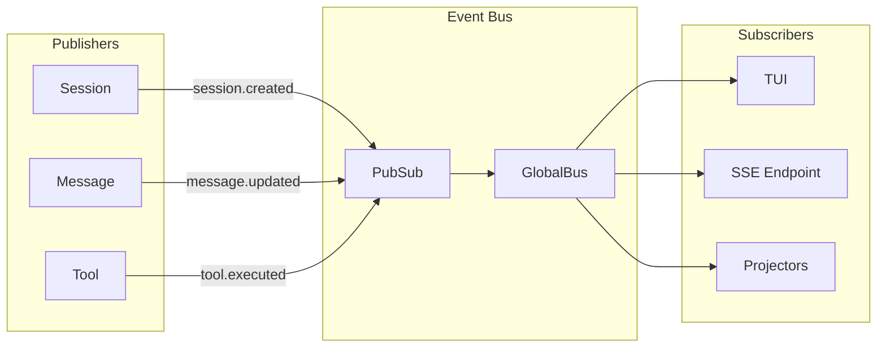

# Module 02 - Lesson 02: Data Flow

## Learning Objectives

By the end of this lesson, you will be able to:
- Trace the complete flow of a user request through the system
- Understand the request/response cycle from CLI to LLM
- Identify the responsibilities of each major module
- Explain how data is transformed at each stage
- Understand the event-driven architecture using the Bus system

---

## High-Level Architecture



---

## The Request Journey

Let's trace what happens when a user sends a message:

### Step 1: User Input (CLI)

The entry point is `packages/opencode/src/index.ts`:

```typescript
// packages/opencode/src/index.ts
import yargs from "yargs"
import { RunCommand } from "./cli/cmd/run"

let cli = yargs(hideBin(process.argv))
  .command(RunCommand)
  // ... other commands
```

The `RunCommand` handles the main chat interaction.

### Step 2: Server Initialization

When opencode starts, it launches an HTTP server:

```typescript
// packages/opencode/src/server/server.ts
export namespace Server {
  export function listen(opts: { port: number; hostname: string }) {
    const app = createApp(opts)
    return Bun.serve({
      hostname: opts.hostname,
      fetch: app.fetch,
    })
  }
}
```

### Step 3: Route Handling

Requests are routed through Hono middleware:

```typescript
// packages/opencode/src/server/server.ts
const app = new Hono()
  .route("/session", SessionRoutes())
  .route("/provider", ProviderRoutes())
  .route("/project", ProjectRoutes())
  // ... more routes
```

### Step 4: Instance Context

Every request is wrapped with an Instance context:

```typescript
// packages/opencode/src/server/server.ts
.use(async (c, next) => {
  const directory = c.req.query("directory") || process.cwd()
  
  return Instance.provide({
    directory,
    init: InstanceBootstrap,
    async fn() {
      return next()
    },
  })
})
```

This ensures each request knows which project directory it's operating in.

---

## Module Responsibilities

### CLI Module (`packages/opencode/src/cli/`)

**Purpose**: User interaction and command parsing

```
cli/
├── cmd/
│   ├── run.ts          # Main chat command
│   ├── serve.ts        # Start server
│   ├── providers.ts    # List providers
│   └── tui/            # Terminal UI components
├── ui.ts               # Output formatting
├── error.ts            # Error display
└── bootstrap.ts        # CLI initialization
```

Key file: `packages/opencode/src/cli/cmd/run.ts`

```typescript
// Handles tool execution display
function bash(info: ToolProps<typeof BashTool>) {
  block({
    icon: "$",
    title: info.input.command,
  }, info.metadata.stdout)
}
```

### Server Module (`packages/opencode/src/server/`)

**Purpose**: HTTP API and WebSocket handling

```
server/
├── server.ts           # Main Hono app
├── routes/
│   ├── session.ts      # Session CRUD
│   ├── provider.ts     # Provider management
│   ├── file.ts         # File operations
│   └── event.ts        # SSE events
└── error.ts            # Error responses
```

Key pattern - route definition:

```typescript
// packages/opencode/src/server/routes/session.ts
export function SessionRoutes() {
  return new Hono()
    .post("/", async (c) => {
      const session = await Session.create()
      return c.json(session)
    })
    .get("/:id", async (c) => {
      const session = await Session.get(c.req.param("id"))
      return c.json(session)
    })
}
```

### Session Module (`packages/opencode/src/session/`)

**Purpose**: Chat session lifecycle and message management

```
session/
├── index.ts            # Session CRUD operations
├── llm.ts              # LLM streaming logic
├── message.ts          # Message handling
├── message-v2.ts       # V2 message format
├── prompt.ts           # Prompt construction
├── schema.ts           # Type definitions
└── session.sql.ts      # Database schema
```

Key flow in `packages/opencode/src/session/llm.ts`:

```typescript
export namespace LLM {
  export async function stream(input: StreamInput) {
    const language = await Provider.getLanguage(input.model)
    
    return streamText({
      model: language,
      messages: input.messages,
      tools: input.tools,
      abortSignal: input.abort,
    })
  }
}
```

### Provider Module (`packages/opencode/src/provider/`)

**Purpose**: LLM provider abstraction and configuration

```
provider/
├── provider.ts         # Provider management
├── transform.ts        # Message transformation
├── models.ts           # Model definitions
├── schema.ts           # Type definitions
└── sdk/                # Custom SDK implementations
    └── copilot/        # GitHub Copilot integration
```

The provider module normalizes different LLM APIs:

```typescript
// packages/opencode/src/provider/provider.ts
const BUNDLED_PROVIDERS: Record<string, (options: any) => SDK> = {
  "@ai-sdk/anthropic": createAnthropic,
  "@ai-sdk/openai": createOpenAI,
  "@ai-sdk/google": createGoogleGenerativeAI,
  // ... more providers
}
```

### Tool Module (`packages/opencode/src/tool/`)

**Purpose**: AI tool implementations

```
tool/
├── tool.ts             # Tool base types
├── registry.ts         # Tool registration
├── bash.ts             # Shell execution
├── edit.ts             # File editing
├── read.ts             # File reading
├── write.ts            # File writing
├── grep.ts             # Code search
├── glob.ts             # File pattern matching
└── task.ts             # Subagent spawning
```

Tool definition pattern:

```typescript
// packages/opencode/src/tool/tool.ts
export namespace Tool {
  export interface Info<Parameters, Metadata> {
    id: string
    init: (ctx?: InitContext) => Promise<{
      description: string
      parameters: Parameters
      execute(args, ctx): Promise<{
        title: string
        metadata: Metadata
        output: string
      }>
    }>
  }
}
```

### Storage Module (`packages/opencode/src/storage/`)

**Purpose**: Data persistence

```
storage/
├── db.ts               # Database connection
├── db.bun.ts           # Bun-specific SQLite
├── db.node.ts          # Node-specific SQLite
├── storage.ts          # File-based storage
└── json-migration.ts   # Legacy data migration
```

---

## Data Flow Diagram



---

## The Event Bus

opencode uses an event-driven architecture for real-time updates:

```typescript
// packages/opencode/src/bus/index.ts
export namespace Bus {
  export async function publish<D extends BusEvent.Definition>(
    def: D, 
    properties: z.output<D["properties"]>
  ) {
    // Publishes to local PubSub and GlobalBus
  }
  
  export function subscribe<D extends BusEvent.Definition>(
    def: D,
    callback: (event) => unknown
  ) {
    // Returns unsubscribe function
  }
}
```

Events flow through the system:



---

## Key Data Structures

### Session Info

```typescript
// packages/opencode/src/session/index.ts
export const Info = z.object({
  id: SessionID.zod,
  slug: z.string(),
  projectID: ProjectID.zod,
  directory: z.string(),
  title: z.string(),
  version: z.string(),
  time: z.object({
    created: z.number(),
    updated: z.number(),
  }),
})
```

### Message Structure

```typescript
// packages/opencode/src/session/message-v2.ts
export const Info = z.discriminatedUnion("role", [
  z.object({
    role: z.literal("user"),
    id: MessageID.zod,
    sessionID: SessionID.zod,
    // ... user-specific fields
  }),
  z.object({
    role: z.literal("assistant"),
    id: MessageID.zod,
    sessionID: SessionID.zod,
    parentID: MessageID.zod,
    // ... assistant-specific fields
  }),
])
```

### Tool Context

```typescript
// packages/opencode/src/tool/tool.ts
export type Context = {
  sessionID: SessionID
  messageID: MessageID
  agent: string
  abort: AbortSignal
  messages: MessageV2.WithParts[]
  metadata(input: { title?: string; metadata?: any }): void
  ask(input: Permission.Request): Promise<void>
}
```

---

## Instance and Project Context

Every operation runs within an Instance context:

```typescript
// packages/opencode/src/project/instance.ts
export interface Shape {
  directory: string    // Working directory
  worktree: string     // Git worktree root
  project: Project.Info
}

export const Instance = {
  async provide<R>(input: { 
    directory: string
    init?: () => Promise<any>
    fn: () => R 
  }): Promise<R> {
    // Sets up AsyncLocalStorage context
  },
  
  get directory() {
    return context.use().directory
  },
  
  get project() {
    return context.use().project
  },
}
```

This allows any code to access the current project context without explicit parameter passing.

---

## Self-Check Questions

1. **What is the entry point for CLI commands?**
   <details>
   <summary>Answer</summary>
   `packages/opencode/src/index.ts` - it uses yargs to parse commands and route to handlers.
   </details>

2. **How does the server know which project directory to use?**
   <details>
   <summary>Answer</summary>
   The `Instance.provide()` middleware wraps each request with an AsyncLocalStorage context containing the directory from the `directory` query parameter or `x-opencode-directory` header.
   </details>

3. **What is the purpose of the Bus system?**
   <details>
   <summary>Answer</summary>
   It provides an event-driven pub/sub system for real-time updates. Components publish events (session.created, message.updated) and subscribers (TUI, SSE endpoints) react to them.
   </details>

4. **How are tool results returned to the LLM?**
   <details>
   <summary>Answer</summary>
   Tools return an object with `title`, `metadata`, and `output`. The output is included in the conversation as a tool result, allowing the LLM to see what the tool did.
   </details>

---

## Exercises

1. **Trace a message**: Add a `console.log` to `packages/opencode/src/session/llm.ts` in the `stream` function. Run opencode and observe when it's called.

2. **Explore events**: Look at `packages/opencode/src/session/index.ts` and find all the event types defined in `Event`. What triggers each one?

3. **Tool anatomy**: Read `packages/opencode/src/tool/read.ts` and identify:
   - What parameters it accepts
   - What it returns
   - How errors are handled

---

## Further Reading

- [Hono Documentation](https://hono.dev/docs/)
- [Vercel AI SDK Streaming](https://sdk.vercel.ai/docs/ai-sdk-core/streaming)
- [AsyncLocalStorage in Node.js](https://nodejs.org/api/async_context.html)
