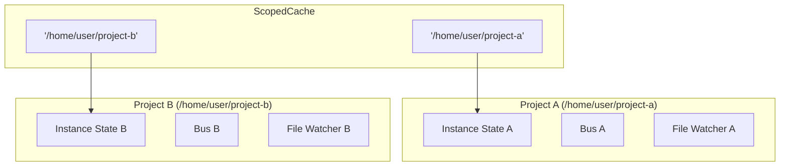

# Module 02 - Lesson 03: Effect Patterns

## Learning Objectives

By the end of this lesson, you will be able to:
- Understand what Effect is and why opencode uses it
- Navigate the files in `src/effect/` and understand their purposes
- Recognize Effect patterns used throughout the codebase
- Understand the difference between Effect services and async/await code
- Read and comprehend Effect-based service definitions

---

## What is Effect?

[Effect](https://effect.website/) is a functional effect system for TypeScript. Think of it as a more powerful alternative to Promises that provides:

- **Type-safe error handling**: Errors are part of the type signature
- **Dependency injection**: Services are declared in types and provided at runtime
- **Resource management**: Automatic cleanup with scopes and finalizers
- **Composability**: Effects can be combined, retried, timed out, etc.

---

## Why opencode Uses Effect

opencode uses Effect for **infrastructure services** that need:

1. **Per-instance state**: Different project directories need isolated state
2. **Automatic cleanup**: Resources like file watchers need proper disposal
3. **Service composition**: Multiple services can share dependencies
4. **Structured concurrency**: Background tasks that respect lifecycle

**Important**: The main chat path uses **async/await**, not Effect. Effect is used for supporting services like the event bus, file watching, and instance state management.

---

## The Effect Files

```
packages/opencode/src/effect/
├── run-service.ts        # Runtime creation helper
├── instance-state.ts     # Per-directory state management
├── instance-registry.ts  # Instance disposal tracking
└── cross-spawn-spawner.ts # Process spawning service
```

---

## `run-service.ts` - Runtime Creation

This file provides a helper to create Effect runtimes for services:

```typescript
// packages/opencode/src/effect/run-service.ts
import { Effect, Layer, ManagedRuntime } from "effect"
import * as ServiceMap from "effect/ServiceMap"

export const memoMap = Layer.makeMemoMapUnsafe()

export function makeRuntime<I, S, E>(
  service: ServiceMap.Service<I, S>, 
  layer: Layer.Layer<I, E>
) {
  let rt: ManagedRuntime.ManagedRuntime<I, E> | undefined
  const getRuntime = () => (rt ??= ManagedRuntime.make(layer, { memoMap }))

  return {
    runSync: <A, Err>(fn: (svc: S) => Effect.Effect<A, Err, I>) => 
      getRuntime().runSync(service.use(fn)),
    runPromise: <A, Err>(fn: (svc: S) => Effect.Effect<A, Err, I>) =>
      getRuntime().runPromise(service.use(fn)),
    runFork: <A, Err>(fn: (svc: S) => Effect.Effect<A, Err, I>) => 
      getRuntime().runFork(service.use(fn)),
    runCallback: <A, Err>(fn: (svc: S) => Effect.Effect<A, Err, I>) => 
      getRuntime().runCallback(service.use(fn)),
  }
}
```

### Key Concepts

- **MemoMap**: Shared cache that deduplicates layer construction
- **ManagedRuntime**: Lazy runtime that builds layers on first use
- **Service.use**: Extracts the service interface for use in effects

### Usage Pattern

```typescript
// Define a service
class MyService extends ServiceMap.Service<MyService, Interface>()("MyService") {}

// Create a layer that provides the service
const layer = Layer.effect(MyService, Effect.gen(function* () {
  // ... initialization
  return MyService.of({ /* interface implementation */ })
}))

// Create runtime helpers
const { runPromise, runSync } = makeRuntime(MyService, layer)

// Use the service
await runPromise((svc) => svc.doSomething())
```

---

## `instance-state.ts` - Per-Directory State

This is the most important Effect pattern in opencode. It manages state that's unique to each project directory:

```typescript
// packages/opencode/src/effect/instance-state.ts
import { Effect, ScopedCache, Scope } from "effect"
import { Instance } from "@/project/instance"
import { registerDisposer } from "./instance-registry"

export interface InstanceState<A, E = never, R = never> {
  readonly cache: ScopedCache.ScopedCache<string, A, E, R>
}

export namespace InstanceState {
  export const make = <A, E = never, R = never>(
    init: (ctx: Shape) => Effect.Effect<A, E, R | Scope.Scope>,
  ) => Effect.gen(function* () {
    const cache = yield* ScopedCache.make<string, A, E, R>({
      capacity: Number.POSITIVE_INFINITY,
      lookup: () => init(Instance.current),
    })

    const off = registerDisposer((directory) => 
      Effect.runPromise(ScopedCache.invalidate(cache, directory))
    )
    yield* Effect.addFinalizer(() => Effect.sync(off))

    return { cache }
  })

  export const get = <A, E, R>(self: InstanceState<A, E, R>) =>
    Effect.suspend(() => ScopedCache.get(self.cache, Instance.directory))
}
```

### How It Works



### Key Concepts

- **ScopedCache**: Caches values by key (directory path) with automatic scope management
- **Scope**: Manages resource lifecycle - when scope closes, resources are cleaned up
- **registerDisposer**: Registers cleanup function called when instance is disposed

---

## `instance-registry.ts` - Disposal Tracking

Simple registry for cleanup functions:

```typescript
// packages/opencode/src/effect/instance-registry.ts
const disposers = new Set<(directory: string) => Promise<void>>()

export function registerDisposer(disposer: (directory: string) => Promise<void>) {
  disposers.add(disposer)
  return () => {
    disposers.delete(disposer)
  }
}

export async function disposeInstance(directory: string) {
  await Promise.allSettled(
    [...disposers].map((disposer) => disposer(directory))
  )
}
```

When a project instance is closed, all registered disposers are called to clean up resources.

---

## Real-World Example: The Bus Service

The event bus (`packages/opencode/src/bus/index.ts`) demonstrates Effect patterns:

```typescript
// packages/opencode/src/bus/index.ts
import { Effect, Layer, PubSub, Scope, ServiceMap, Stream } from "effect"
import { InstanceState } from "@/effect/instance-state"
import { makeRuntime } from "@/effect/run-service"

export namespace Bus {
  // Define the service interface
  export interface Interface {
    readonly publish: <D>(def: D, properties: any) => Effect.Effect<void>
    readonly subscribe: <D>(def: D) => Stream.Stream<Payload<D>>
  }

  // Create a service class
  export class Service extends ServiceMap.Service<Service, Interface>()("@opencode/Bus") {}

  // Define the layer that provides the service
  export const layer = Layer.effect(
    Service,
    Effect.gen(function* () {
      // Create per-instance state
      const cache = yield* InstanceState.make<State>(
        Effect.fn("Bus.state")(function* (ctx) {
          const wildcard = yield* PubSub.unbounded<Payload>()
          const typed = new Map<string, PubSub.PubSub<Payload>>()

          // Register cleanup when instance is disposed
          yield* Effect.addFinalizer(() =>
            Effect.gen(function* () {
              yield* PubSub.shutdown(wildcard)
              for (const ps of typed.values()) {
                yield* PubSub.shutdown(ps)
              }
            }),
          )

          return { wildcard, typed }
        }),
      )

      // Implement the interface
      function publish<D>(def: D, properties: any) {
        return Effect.gen(function* () {
          const state = yield* InstanceState.get(cache)
          const payload = { type: def.type, properties }
          yield* PubSub.publish(state.wildcard, payload)
        })
      }

      return Service.of({ publish, subscribe, /* ... */ })
    }),
  )

  // Create runtime helpers
  const { runPromise, runSync } = makeRuntime(Service, layer)

  // Export async/await wrappers
  export async function publish<D>(def: D, properties: any) {
    return runPromise((svc) => svc.publish(def, properties))
  }
}
```

### Pattern Breakdown

1. **Service Definition**: `ServiceMap.Service` creates a tagged service type
2. **Layer**: `Layer.effect` creates the service implementation
3. **InstanceState**: Per-directory state with automatic cleanup
4. **Finalizers**: `Effect.addFinalizer` registers cleanup code
5. **Runtime**: `makeRuntime` creates helpers to run effects
6. **Public API**: Async/await wrappers hide Effect from callers

---

## Basic Effect Concepts

### Effect Type

```typescript
Effect.Effect<Success, Error, Requirements>
```

- **Success**: The type returned on success
- **Error**: The type of errors that can occur
- **Requirements**: Services needed to run the effect

### Creating Effects

```typescript
// From a value
const value = Effect.succeed(42)

// From an error
const error = Effect.fail(new Error("oops"))

// From a promise
const fromPromise = Effect.tryPromise(() => fetch("/api"))

// Generator syntax (most common in opencode)
const program = Effect.gen(function* () {
  const a = yield* Effect.succeed(1)
  const b = yield* Effect.succeed(2)
  return a + b
})
```

### Running Effects

```typescript
// To Promise
const result = await Effect.runPromise(program)

// Synchronously (if effect is sync)
const result = Effect.runSync(program)

// Fork as fiber (background)
const fiber = Effect.runFork(program)
```

---

## Effect Patterns in opencode

### Pattern 1: Effect.fn for Named/Traced Effects

```typescript
const myFunction = Effect.fn("Module.method")(function* (arg: string) {
  // Function body
  return yield* doSomething(arg)
})
```

### Pattern 2: Effect.gen for Composition

```typescript
const program = Effect.gen(function* () {
  const config = yield* loadConfig()
  const db = yield* connectDatabase(config)
  const result = yield* query(db, "SELECT * FROM users")
  return result
})
```

### Pattern 3: Effect.addFinalizer for Cleanup

```typescript
const withResource = Effect.gen(function* () {
  const resource = yield* acquireResource()
  
  yield* Effect.addFinalizer(() => 
    Effect.sync(() => resource.close())
  )
  
  return resource
})
```

### Pattern 4: Yielding Errors Directly

```typescript
// Instead of Effect.fail
const program = Effect.gen(function* () {
  if (condition) {
    yield* new MyError({ message: "Something went wrong" })
  }
  return success
})
```

---

## When to Use Effect vs Async/Await

| Use Effect When | Use Async/Await When |
|-----------------|---------------------|
| Managing per-instance state | Simple request handlers |
| Resources need cleanup | One-off operations |
| Complex service composition | Straightforward async code |
| Background tasks with lifecycle | Direct LLM interactions |

In opencode:
- **Effect**: Bus, InstanceState, file watchers, process spawning
- **Async/Await**: Session operations, tool execution, LLM streaming

---

## Self-Check Questions

1. **What is the purpose of `InstanceState`?**
   <details>
   <summary>Answer</summary>
   It manages state that's unique to each project directory. Each open project gets its own isolated state, and the state is automatically cleaned up when the project is closed.
   </details>

2. **Why does opencode use a shared `memoMap`?**
   <details>
   <summary>Answer</summary>
   The memoMap deduplicates layer construction. If multiple services depend on the same layer, it's only built once and shared.
   </details>

3. **What does `Effect.addFinalizer` do?**
   <details>
   <summary>Answer</summary>
   It registers a cleanup function that runs when the scope closes. This is used for resource cleanup like shutting down PubSub instances or closing file handles.
   </details>

4. **Why does the Bus export async/await wrappers?**
   <details>
   <summary>Answer</summary>
   To provide a simple API for code that doesn't use Effect. The internal implementation uses Effect for proper resource management, but callers can use familiar async/await syntax.
   </details>

---

## Exercises

1. **Read the Bus implementation**: Open `packages/opencode/src/bus/index.ts` and identify:
   - Where InstanceState is created
   - What finalizers are registered
   - How the public API wraps Effect

2. **Trace InstanceState**: Add logging to `packages/opencode/src/effect/instance-state.ts` in the `make` function to see when new instances are created.

3. **Find Effect usage**: Search the codebase for `Effect.gen` to find other services using Effect patterns.

---

## Further Reading

- [Effect Documentation](https://effect.website/docs/introduction)
- [Effect GitHub](https://github.com/Effect-TS/effect)
- [Effect Discord](https://discord.gg/effect-ts)
- opencode's Effect rules: `packages/opencode/AGENTS.md` (Effect section)
