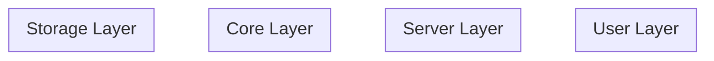

# Module 02 - Exercise: Architecture Mapping

## Overview

In this exercise, you'll actively explore the opencode codebase to build a mental model of its architecture. You'll map the folder structure, trace requests, and create your own diagrams.

---

## Exercise 1: Map the Folder Structure

### Task

Create a detailed map of `packages/opencode/src/` showing the purpose of each top-level directory.

### Steps

1. Run this command to see the top-level directories:
   ```bash
   ls packages/opencode/src/
   ```

2. For each directory, open one or two key files and determine:
   - What is the primary responsibility?
   - What other modules does it depend on?
   - What does it export?

3. Fill in this table:

| Directory | Primary Responsibility | Key Dependencies | Key Exports |
|-----------|----------------------|------------------|-------------|
| `cli/` | | | |
| `server/` | | | |
| `session/` | | | |
| `provider/` | | | |
| `tool/` | | | |
| `storage/` | | | |
| `bus/` | | | |
| `effect/` | | | |
| `project/` | | | |
| `config/` | | | |
| `agent/` | | | |
| `mcp/` | | | |
| `permission/` | | | |

### Hints

- Look at the imports at the top of each file
- Check for `export namespace` or `export const` statements
- The `index.ts` file often shows the main exports

---

## Exercise 2: Trace a Request

### Task

Trace what happens when a user sends a message through the CLI.

### Scenario

User runs: `opencode "What files are in this directory?"`

### Steps

1. **Find the entry point**
   - Open `packages/opencode/src/index.ts`
   - Find where `RunCommand` is imported from
   - Open that file

2. **Trace the CLI handler**
   - In `packages/opencode/src/cli/cmd/run.ts`, find where user input is processed
   - Identify what function is called to send the message

3. **Follow to the server**
   - Find the session route handler in `packages/opencode/src/server/routes/session.ts`
   - Identify the endpoint that handles new messages

4. **Trace to the LLM**
   - Open `packages/opencode/src/session/llm.ts`
   - Find the `stream` function
   - Note what parameters it receives

5. **Document the flow**
   
   Fill in the blanks:
   ```
   User Input
       ↓
   _____________ (file: cli/cmd/run.ts)
       ↓
   _____________ (file: server/routes/session.ts)
       ↓
   _____________ (file: session/index.ts)
       ↓
   _____________ (file: session/llm.ts)
       ↓
   Provider.getLanguage() → LLM API
   ```

---

## Exercise 3: Identify Module Responsibilities

### Task

For each scenario, identify which module(s) handle it.

### Scenarios

1. **User wants to read a file**
   - Which tool handles this?
   - What file defines the tool?
   - What does the tool return?

2. **User wants to edit a file**
   - Which tool handles this?
   - How does it validate the edit?
   - What permissions might be needed?

3. **Session needs to be saved**
   - Which module handles persistence?
   - What database table stores sessions?
   - How are messages stored?

4. **LLM response is streaming**
   - Which module handles the stream?
   - How are partial responses sent to the client?
   - What events are published?

### Your Answers

```
1. File Reading:
   - Tool: 
   - File: 
   - Returns: 

2. File Editing:
   - Tool: 
   - File: 
   - Validation: 
   - Permissions: 

3. Session Persistence:
   - Module: 
   - Table: 
   - Message storage: 

4. LLM Streaming:
   - Module: 
   - Client delivery: 
   - Events: 
```

---

## Exercise 4: Draw Your Own Architecture Diagram

### Task

Create a diagram showing how data flows through opencode.

### Requirements

Your diagram should show:
1. User interfaces (CLI, API)
2. Server layer
3. Core processing (Session, LLM)
4. Tool system
5. Storage layer
6. External services (LLM providers)

### Format Options

Choose one:
- ASCII art (like the examples in the lessons)
- Mermaid diagram (can be rendered in GitHub/VS Code)
- Hand-drawn sketch (take a photo)
- Any diagramming tool (draw.io, Excalidraw, etc.)

### Template (Mermaid)



---

## Exercise 5: Find the Effect Services

### Task

Identify all services that use the Effect pattern.

### Steps

1. Search for `ServiceMap.Service` in the codebase:
   ```bash
   rg "ServiceMap.Service" packages/opencode/src/
   ```

2. For each service found, document:
   - Service name
   - File location
   - What it manages
   - Whether it uses InstanceState

### Your Findings

| Service Name | File | Purpose | Uses InstanceState? |
|--------------|------|---------|---------------------|
| | | | |
| | | | |
| | | | |

---

## Exercise 6: Explore the Tool System

### Task

Understand how tools are defined and registered.

### Steps

1. Open `packages/opencode/src/tool/tool.ts` and understand the `Tool.Info` interface

2. Open `packages/opencode/src/tool/read.ts` as an example tool

3. Answer these questions:
   - How is a tool's schema defined?
   - How does a tool report its output?
   - How does a tool request permissions?
   - How is output truncated?

4. Find the tool registry:
   - Where are tools registered?
   - How does the LLM know what tools are available?

### Your Notes

```
Tool Schema Definition:


Tool Output Format:


Permission Requests:


Output Truncation:


Tool Registry Location:


Tool Discovery:

```

---

## Bonus Challenge: Add Logging

### Task

Add strategic logging to trace a request through the system.

### Steps

1. Add a `console.log` at the start of these functions:
   - `packages/opencode/src/cli/cmd/run.ts` - main handler
   - `packages/opencode/src/session/llm.ts` - `stream` function
   - `packages/opencode/src/tool/read.ts` - `execute` function

2. Run opencode with a simple query that triggers the read tool:
   ```bash
   opencode "Read the package.json file"
   ```

3. Observe the order of log messages

4. Remove the logging when done

### Expected Order

```
1. CLI handler called
2. LLM stream started
3. (LLM decides to use read tool)
4. Read tool executed
5. (LLM processes result)
6. Response complete
```

---

## Submission Checklist

- [ ] Completed folder structure table (Exercise 1)
- [ ] Documented request trace (Exercise 2)
- [ ] Identified module responsibilities (Exercise 3)
- [ ] Created architecture diagram (Exercise 4)
- [ ] Listed Effect services (Exercise 5)
- [ ] Documented tool system (Exercise 6)
- [ ] (Bonus) Verified logging order

---

## Reflection Questions

After completing these exercises, consider:

1. What surprised you about the architecture?
2. Which module was hardest to understand? Why?
3. How does the separation of concerns help maintainability?
4. What would you change about the architecture?

Write a brief (2-3 paragraph) reflection on what you learned.
